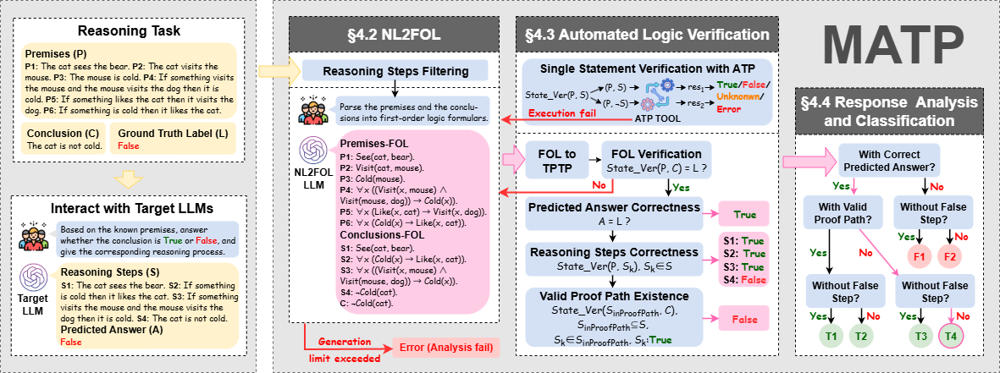
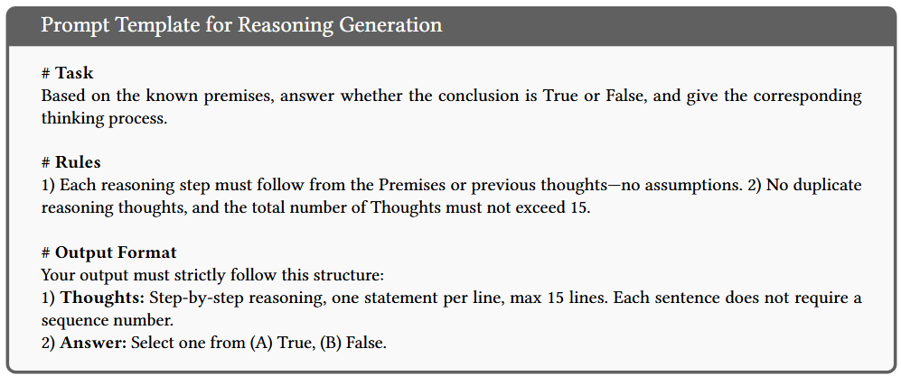
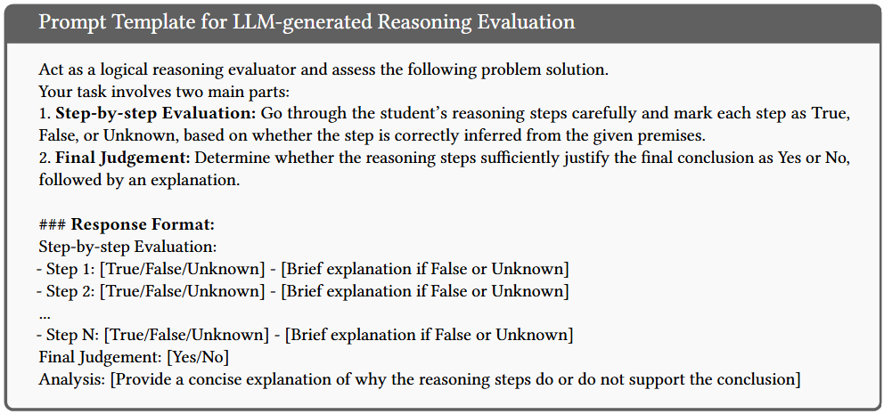
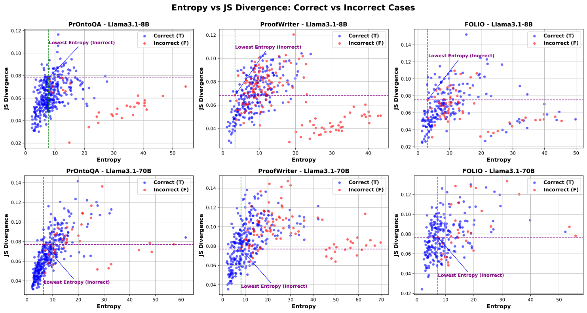

# MATP

This repository contains the datasets and source code for the paper "**Beyond Correctness: Exposing LLM-generated Logical Flaws in Reasoning via Multi-step Automated Theorem Proving**".


## Overview



## Prompt
All the prompts used in our paper can be found in `./ProcessAgent/constant/prompt`.

### Prompt Template for Reasoning Generation
We use a structured one-shot prompt to instruct the LLM to determine whether a given conclusion logically follows from a set of premises. The prompt is designed to elicit a step-by-step reasoning process (referred to as *Thoughts*) followed by a binary decision (*Answer*). The full prompt template is shown below:


### Prompt Template for LLM-generated Reasoning Evaluation
We compare MATP with a prompting-based baseline using GPT-4o and DeepSeek-R1, following the setup adapted
from [1]. The designed one-shot prompt guides the model to (1) label each reasoning step as *True*, *False*, or *Unknown*, and (2) judge whether the reasoning chain supports the predicted answer (*Yes* or *No*), along with explanations for both. The full prompt template is shown below:


## Discussion


## Execution Example of MATP
The following are the specific execution results of MATP on several examples. 

All execution results are saved in the directory `./workspace/dataset_v_last/RQ1_RQ3`, including all intermediate results such as FOL, TPTP, etc. Due to upload size limitations, the execution logs of Vampire have not been uploaded. They will be uploaded to the public repository later.

### Example from FOLIO
- Reasoning task from FOLIO
```json
{
    "idx": "312_776",
    "premises": [
        "To have the authorization to study in the United States as a foreigner, you must be enrolled in an academic program.",
        "Those who are enrolled in an academic program can not work full-time.",
        "Every who studies in the United States as a foreigner has the authorization to study in the U.S.",
        "All PhD graduate can work full-time. ",
            "If Tom does not study in the United States as a foreigner, he is enrolled in an academic program."
    ],
    "question": [
        "Tom is a PhD graduate."
    ],
    "premises_gt_fol": [
        "∀x (Have(x, authorization, studyIn, unitedStates) → EnrolledIn(x, academicProgram))",
        "∀x (EnrolledIn(x, academicProgram) → ¬Work(x, fullTime))",
        "∀x (StudyIn(x, unitedStates) → Have(x, authorization, studyIn, unitedStates))",
        "∀x (PhDGraduate(x) → Work(x, fullTime))",
        "¬StudyIn(x, unitedStates) → EnrolledIn(x, academicProgram)"
    ],
    "label": -1
}
```
- Reasoning output from DeepSeek-R1 
```json
{
    "reasoning_steps": [
        "All who study in the U.S. as foreigners have authorization, requiring enrollment.",
        "If Tom studies as a foreigner, he is enrolled.",
        "If Tom does not study as a foreigner, he is still enrolled (per premise\n.",
        "Thus, Tom is enrolled regardless.",
        "Enrolled individuals cannot work fulltime.",
        "PhD graduates can work fulltime.",
        "If Tom were a PhD graduate, he could work fulltime, but he is enrolled and cannot.",
        "This contradiction means Tom cannot be a PhD graduate."
    ],
    "filter_reasoning_steps": [
        "All who study in the U.S. as foreigners have authorization, requiring enrollment.",
        "If Tom studies as a foreigner, he is enrolled.",
        "If Tom does not study as a foreigner, he is still enrolled (per premise\n.",
        "Thus, Tom is enrolled regardless.",
        "Enrolled individuals cannot work fulltime.",
        "PhD graduates can work fulltime.",
        "If Tom were a PhD graduate, he could work fulltime, but he is enrolled and cannot.",
        null
    ],
    "reasoning_answer": -1,
    "reasoning_content": "Okay, let me try to work through this problem step by step. So, the premises are about the conditions required to study in the U.S. as a foreigner, and some rules about enrollment and working. The conclusion is that Tom is a PhD graduate.\n\nFirst, let's list out the premises to understand them clearly:\n\n1. To have authorization to study in the U.S. as a foreigner, you must be enrolled in an academic program.\n2. Those enrolled in an academic program cannot work full-time.\n3. Everyone who studies in the U.S. as a foreigner has the authorization to do so.\n4. All PhD graduates can work full-time.\n5. If Tom does not study in the U.S. as a foreigner, he is enrolled in an academic program.\n\nAnd the conclusion is that Tom is a PhD graduate.\n\nLet me break this down. \n\nFrom premise 3, if Tom is studying in the U.S. as a foreigner, he has authorization. Premise 1 says authorization requires enrollment. So, if Tom is studying there, he must be enrolled. But premise 2 says enrolled students can't work full-time. \n\nNow, premise 4 states that PhD graduates can work full-time. So if Tom were a PhD graduate, he could work full-time. But if he's enrolled (as per being authorized to study), he can't work full-time. That seems contradictory. Wait, maybe there's another angle.\n\nPremise 5: If Tom does NOT study in the U.S. as a foreigner, then he is enrolled. But the contrapositive might be useful here. So, if Tom is not enrolled, then he does study in the U.S. as a foreigner. Wait, no, the original is \"If not A, then B\", where A is \"Tom studies as foreigner\", and B is \"enrolled\". So if he's not studying as a foreigner, he is enrolled. But how does that connect?\n\nLet's consider two cases for Tom: either he studies as a foreigner or he doesn't.\n\nCase 1: Tom studies as a foreigner. Then by premise 3, he has authorization, which by premise 1 means he's enrolled. Then by premise 2, he can't work full-time. But premise 4 says PhD graduates can work full-time. Therefore, if Tom is a PhD graduate, he can work full-time, but if he's enrolled, he can't. So this would create a contradiction. Therefore, if Tom is a PhD grad, he can't be enrolled, which would mean he can't study as a foreigner. But if he's a PhD grad not studying as a foreigner, premise 5 says he's enrolled. But then again, if he's enrolled, he can't work full-time, but as a PhD grad he can. Contradiction again. Hmm, maybe I'm getting tangled here.\n\nCase 2: Tom does NOT study as a foreigner. Then by premise 5, he is enrolled in an academic program. But premise 2 says enrolled students can't work full-time. However, if Tom is a PhD graduate (the conclusion), he can work full-time (premise 4). So if he's a PhD grad and enrolled, that would mean he both can and cannot work full-time, which is impossible. Therefore, this case would also lead to a contradiction if Tom is a PhD grad. \n\nWait, but the conclusion is that Tom is a PhD graduate. The premises must lead to this conclusion. But according to the above reasoning, both cases lead to contradictions. That can't be right. Maybe I'm missing something.\n\nAlternatively, perhaps the conclusion is false. Let's see. Suppose Tom is not a PhD graduate. Then there's no contradiction. But how do we get to the conclusion?\n\nAlternatively, maybe we need to use the premises to see if Tom must be a PhD graduate. Let's try to derive it step by step.\n\nStart with the premises:\n\n- All PhD graduates can work full-time. (Premise 4)\n- Those enrolled can't work full-time. (Premise 2)\n- If someone is enrolled, they can't work full-time. So PhD graduates can't be enrolled, because otherwise they'd have a conflict. Therefore, if Tom is a PhD graduate, he can't be enrolled. But how does that connect?\n\nFrom premise 1: Authorization requires enrollment. But premise 3 says everyone studying as a foreigner has authorization. So if Tom is studying as a foreigner, he must be enrolled (from 1 and 3). If he's enrolled, he can't work full-time. But PhD graduates can work full-time. So if Tom is a PhD graduate, he can't be enrolled, which would mean he can't be studying as a foreigner (since studying as foreigner requires enrollment). Therefore, if Tom is a PhD graduate, he does not study as a foreigner. But premise 5 says that if he does not study as a foreigner, then he is enrolled. Wait, so if he's a PhD grad, he can't be enrolled (since he can work full-time), but premise 5 says if he doesn't study as a foreigner, he must be enrolled. So this leads to a contradiction. Therefore, the assumption that Tom is a PhD graduate leads to a contradiction, meaning the conclusion is false.\n\nBut wait, this is confusing. Let me rephrase.\n\nSuppose Tom is a PhD graduate. Then he can work full-time (premise 4). If he can work full-time, he cannot be enrolled (premise 2 says enrolled can't work full-time). So Tom is not enrolled. Now, if he's not enrolled, then according to premise 1, he doesn't have authorization to study as a foreigner. But premise 3 says that everyone studying as a foreigner has authorization. So if Tom is studying as a foreigner, he must have authorization (premise 3), which requires enrollment (premise 1). But if he's a PhD graduate, he's not enrolled. Therefore, he can't be studying as a foreigner. So if he's not studying as a foreigner, premise 5 says he is enrolled. But we just concluded he's not enrolled (as a PhD grad), so that's a contradiction. Therefore, Tom cannot be a PhD graduate. Therefore, the conclusion that Tom is a PhD graduate is false.\n\nWait, but that contradicts the initial conclusion. But according to the premises, assuming Tom is a PhD grad leads to a contradiction, so the conclusion must be false. Therefore, the answer would be (B) False.\n\nBut let me check again.\n\nAnother angle: Let's see what premises lead to what.\n\nPremise 5: If Tom does not study in the U.S. as a foreigner, he is enrolled. So, Tom is either studying as a foreigner (and thus enrolled) or not studying as a foreigner (and thus enrolled). Wait, that can't be. Because premise 5 is a conditional: If not A, then B. So if Tom is not studying as a foreigner (¬A), then he is enrolled (B). But if he is studying as a foreigner (A), then premise 3 and 1 apply: he's enrolled. So regardless of whether Tom studies as a foreigner or not, he must be enrolled. Because if he's not a foreign student, premise 5 says he's enrolled. If he is a foreign student, premise 1 and 3 make him enrolled. Therefore, Tom is enrolled in an academic program no matter what. \n\nSo Tom is enrolled. From premise 2, enrolled students cannot work full-time. Therefore, Tom cannot work full-time. But premise 4 says all PhD graduates can work full-time. Therefore, if Tom were a PhD graduate, he could work full-time, but he can't because he's enrolled. Therefore, Tom cannot be a PhD graduate. Therefore, the conclusion is false.\n\nSo the answer should be (B) False.",
    "content": "Thoughts:\nAll who study in the U.S. as foreigners have authorization, requiring enrollment.\nIf Tom studies as a foreigner, he is enrolled.\nIf Tom does not study as a foreigner, he is still enrolled (per premise 5).\nThus, Tom is enrolled regardless.\nEnrolled individuals cannot work full-time.\nPhD graduates can work full-time.\nIf Tom were a PhD graduate, he could work full-time, but he is enrolled and cannot.\nThis contradiction means Tom cannot be a PhD graduate.\nAnswer:\n(B) False"
}
```
- Intermediate results: FOL and TPTP
```json
{
    "premise:_fol": [
        {
            "ref": "(1) to have the authorization to study in the united states as a foreigner, you must be enrolled in an academic program.",
            "fol": "∀x (authorization(x) → enrolled(x))",
            "tptp": "![X]: (authorization(X) => enrolled(X))"
        },
        {
            "ref": "(2) those who are enrolled in an academic program can not work full-time.",
            "fol": "∀x (enrolled(x) → ¬workfulltime(x))",
            "tptp": "![X]: (enrolled(X) => ~workfulltime(X))"
        },
        {
            "ref": "(3) every who studies in the united states as a foreigner has the authorization to study in the u.s.",
            "fol": "∀x (studiesinus(x) → authorization(x))",
            "tptp": "![X]: (studiesinus(X) => authorization(X))"
        },
        {
            "ref": "(4) all phd graduate can work full-time.",
            "fol": "∀x (phdgraduate(x) → workfulltime(x))",
            "tptp": "![X]: (phdgraduate(X) => workfulltime(X))"
        },
        {
            "ref": "(5) if tom does not study in the united states as a foreigner, he is enrolled in an academic program.",
            "fol": "¬studiesinus(tom) → enrolled(tom)",
            "tptp": "~studiesinus(tom) => enrolled(tom)"
        }
    ],
    "conclusion:_fol": {
        "ref": "(8) tom is a phd graduate.",
        "fol": "phdgraduate(tom)",
        "tptp": "phdgraduate(tom)"
    },
    "steps:_fol": [
        {
            "ref": "(1) all who study in the u.s. as foreigners have authorization, requiring enrollment.",
            "fol": "∀x (studiesinus(x) → (authorization(x) ∧ enrolled(x)))",
            "tptp": "![X]: (studiesinus(X) => (authorization(X) & enrolled(X)))"
        },
        {
            "ref": "(2) if tom studies as a foreigner, he is enrolled.",
            "fol": "studiesinus(tom) → enrolled(tom)",
            "tptp": "studiesinus(tom) => enrolled(tom)"
        },
        {
            "ref": "(3) if tom does not study as a foreigner, he is still enrolled (per premise).",
            "fol": "¬studiesinus(tom) → enrolled(tom)",
            "tptp": "~studiesinus(tom) => enrolled(tom)"
        },
        {
            "ref": "(4) thus, tom is enrolled regardless.",
            "fol": "enrolled(tom)",
            "tptp": "enrolled(tom)"
        },
        {
            "ref": "(5) enrolled individuals cannot work fulltime.",
            "fol": "∀x (enrolled(x) → ¬workfulltime(x))",
            "tptp": "![X]: (enrolled(X) => ~workfulltime(X))"
        },
        {
            "ref": "(6) phd graduates can work fulltime.",
            "fol": "∀x (phdgraduate(x) → workfulltime(x))",
            "tptp": "![X]: (phdgraduate(X) => workfulltime(X))"
        },
        {
            "ref": "(7) if tom were a phd graduate, he could work fulltime, but he is enrolled and cannot.",
            "fol": "(phdgraduate(tom) → workfulltime(tom)) ∧ enrolled(tom) ∧ ¬workfulltime(tom)",
            "tptp": "(phdgraduate(tom) => workfulltime(tom)) & enrolled(tom) & ~workfulltime(tom)"
        }
    ]
}
```
- Final results
```json
{
    "final_filter_reasoning_steps": [
        "All who study in the U.S. as foreigners have authorization, requiring enrollment.",
        "If Tom studies as a foreigner, he is enrolled.",
        "If Tom does not study as a foreigner, he is still enrolled (per premise\n.",
        "Thus, Tom is enrolled regardless.",
        "Enrolled individuals cannot work fulltime.",
        "PhD graduates can work fulltime.",
        "If Tom were a PhD graduate, he could work fulltime, but he is enrolled and cannot."
    ],
    "AnswerCorrect": true,
    "step_correctness_label": [
        "True",
        "True",
        "True",
        "True",
        "True",
        "True",
        "True"
    ],
    "has_valid_proof_path_label": true,
    "cate": "T1"
}
```

### Example from ProofWriter
- Reasoning task from ProofWriter
```json
{
    "idx": "ProofWriter_RelNoneg-OWA-D5-280_Q8",
    "premises": [
        "The bald eagle needs the mouse.",
        "The bald eagle sees the mouse.",
        "The cow is red.",
        "The cow is rough.",
        "The cow sees the bald eagle.",
        "The cow sees the mouse.",
        "The dog eats the bald eagle.",
        "The dog is cold.",
        "The dog is rough.",
        "The dog needs the bald eagle.",
        "The mouse eats the bald eagle.",
        "The mouse eats the dog.",
        "The mouse is red.",
        "The mouse is rough.",
        "The mouse is young.",
        "The mouse sees the cow.",
        "If something is young then it needs the dog.",
        "If something eats the cow then the cow is kind.",
        "If something is young then it sees the bald eagle.",
        "If something is cold and it needs the dog then it eats the mouse.",
        "If something needs the bald eagle and it is red then it is young.",
        "If something eats the mouse then it needs the mouse.",
        "If something eats the bald eagle then it is red."
    ],
    "question": [
        "The dog does not need the dog."
    ],
    "label": -1
}
```
- Reasoning output from GPT-4o
```json
{
    "reasoning_steps": [
        "The mouse is young.",
        "If something is young then it needs the dog.",
        "The mouse needs the dog.",
        "The dog needs the bald eagle.",
        "The dog is cold.",
        "If something is cold and it needs the dog then it eats the mouse.",
        "The dog eats the mouse.",
        "If something eats the mouse then it needs the mouse.",
        "The dog needs the mouse.",
        "The dog needs the dog.",
        "There is evidence to conclude that the dog needs the dog."
    ],
    "filter_reasoning_steps": [
        "The mouse is young.",
        "If something is young then it needs the dog.",
        "The mouse needs the dog.",
        "The dog needs the bald eagle.",
        "The dog is cold.",
        "If something is cold and it needs the dog then it eats the mouse.",
        "The dog eats the mouse.",
        "If something eats the mouse then it needs the mouse.",
        "The dog needs the mouse.",
        "The dog needs the dog.",
        null
    ],
    "reasoning_answer": -1,
    "reasoning_content": "",
    "content": "Thoughts:\nThe mouse is young.\nIf something is young then it needs the dog.\nThe mouse needs the dog.\nThe dog needs the bald eagle.\nThe dog is cold.\nIf something is cold and it needs the dog then it eats the mouse.\nThe dog eats the mouse.\nIf something eats the mouse then it needs the mouse.\nThe dog needs the mouse.\nThe dog needs the dog.\nThere is evidence to conclude that the dog needs the dog.\nAnswer:\n(B) False"
}
```
- Intermediate results: FOL and TPTP
```json
{
    "premise:_fol": [
        {
            "ref": "(1) the bald eagle needs the mouse.",
            "fol": "needs(bald_eagle, mouse)",
            "tptp": "needs(bald_eagle, mouse)"
        },
        {
            "ref": "(2) the bald eagle sees the mouse.",
            "fol": "sees(bald_eagle, mouse)",
            "tptp": "sees(bald_eagle, mouse)"
        },
        {
            "ref": "(3) the cow is red.",
            "fol": "red(cow)",
            "tptp": "red(cow)"
        },
        {
            "ref": "(4) the cow is rough.",
            "fol": "rough(cow)",
            "tptp": "rough(cow)"
        },
        {
            "ref": "(5) the cow sees the bald eagle.",
            "fol": "sees(cow, bald_eagle)",
            "tptp": "sees(cow, bald_eagle)"
        },
        {
            "ref": "(6) the cow sees the mouse.",
            "fol": "sees(cow, mouse)",
            "tptp": "sees(cow, mouse)"
        },
        {
            "ref": "(7) the dog eats the bald eagle.",
            "fol": "eats(dog, bald_eagle)",
            "tptp": "eats(dog, bald_eagle)"
        },
        {
            "ref": "(8) the dog is cold.",
            "fol": "cold(dog)",
            "tptp": "cold(dog)"
        },
        {
            "ref": "(9) the dog is rough.",
            "fol": "rough(dog)",
            "tptp": "rough(dog)"
        },
        {
            "ref": "(10) the dog needs the bald eagle.",
            "fol": "needs(dog, bald_eagle)",
            "tptp": "needs(dog, bald_eagle)"
        },
        {
            "ref": "(11) the mouse eats the bald eagle.",
            "fol": "eats(mouse, bald_eagle)",
            "tptp": "eats(mouse, bald_eagle)"
        },
        {
            "ref": "(12) the mouse eats the dog.",
            "fol": "eats(mouse, dog)",
            "tptp": "eats(mouse, dog)"
        },
        {
            "ref": "(13) the mouse is red.",
            "fol": "red(mouse)",
            "tptp": "red(mouse)"
        },
        {
            "ref": "(14) the mouse is rough.",
            "fol": "rough(mouse)",
            "tptp": "rough(mouse)"
        },
        {
            "ref": "(15) the mouse is young.",
            "fol": "young(mouse)",
            "tptp": "young(mouse)"
        },
        {
            "ref": "(16) the mouse sees the cow.",
            "fol": "sees(mouse, cow)",
            "tptp": "sees(mouse, cow)"
        },
        {
            "ref": "(17) if something is young then it needs the dog.",
            "fol": "∀x (young(x) → needs(x, dog))",
            "tptp": "![X]: (young(X) => needs(X, dog))"
        },
        {
            "ref": "(18) if something eats the cow then the cow is kind.",
            "fol": "∀x (eats(x, cow) → kind(cow))",
            "tptp": "![X]: (eats(X, cow) => kind(cow))"
        },
        {
            "ref": "(19) if something is young then it sees the bald eagle.",
            "fol": "∀x (young(x) → sees(x, bald_eagle))",
            "tptp": "![X]: (young(X) => sees(X, bald_eagle))"
        },
        {
            "ref": "(20) if something is cold and it needs the dog then it eats the mouse.",
            "fol": "∀x ((cold(x) ∧ needs(x, dog)) → eats(x, mouse))",
            "tptp": "![X]: ((cold(X) & needs(X, dog)) => eats(X, mouse))"
        },
        {
            "ref": "(21) if something needs the bald eagle and it is red then it is young.",
            "fol": "∀x ((needs(x, bald_eagle) ∧ red(x)) → young(x))",
            "tptp": "![X]: ((needs(X, bald_eagle) & red(X)) => young(X))"
        },
        {
            "ref": "(22) if something eats the mouse then it needs the mouse.",
            "fol": "∀x (eats(x, mouse) → needs(x, mouse))",
            "tptp": "![X]: (eats(X, mouse) => needs(X, mouse))"
        },
        {
            "ref": "(23) if something eats the bald eagle then it is red.",
            "fol": "∀x (eats(x, bald_eagle) → red(x))",
            "tptp": "![X]: (eats(X, bald_eagle) => red(X))"
        }
    ],
    "conclusion:_fol": {
        "ref": "(11) the dog does not need the dog.",
        "fol": "¬needs(dog, dog)",
        "tptp": "~needs(dog, dog)"
    },
    "steps:_fol": [
        {
            "ref": "(1) the mouse is young.",
            "fol": "young(mouse)",
            "tptp": "young(mouse)"
        },
        {
            "ref": "(2) if something is young then it needs the dog.",
            "fol": "∀x (young(x) → needs(x, dog))",
            "tptp": "![X]: (young(X) => needs(X, dog))"
        },
        {
            "ref": "(3) the mouse needs the dog.",
            "fol": "needs(mouse, dog)",
            "tptp": "needs(mouse, dog)"
        },
        {
            "ref": "(4) the dog needs the bald eagle.",
            "fol": "needs(dog, bald_eagle)",
            "tptp": "needs(dog, bald_eagle)"
        },
        {
            "ref": "(5) the dog is cold.",
            "fol": "cold(dog)",
            "tptp": "cold(dog)"
        },
        {
            "ref": "(6) if something is cold and it needs the dog then it eats the mouse.",
            "fol": "∀x ((cold(x) ∧ needs(x, dog)) → eats(x, mouse))",
            "tptp": "![X]: ((cold(X) & needs(X, dog)) => eats(X, mouse))"
        },
        {
            "ref": "(7) the dog eats the mouse.",
            "fol": "eats(dog, mouse)",
            "tptp": "eats(dog, mouse)"
        },
        {
            "ref": "(8) if something eats the mouse then it needs the mouse.",
            "fol": "∀x (eats(x, mouse) → needs(x, mouse))",
            "tptp": "![X]: (eats(X, mouse) => needs(X, mouse))"
        },
        {
            "ref": "(9) the dog needs the mouse.",
            "fol": "needs(dog, mouse)",
            "tptp": "needs(dog, mouse)"
        }
    ]
}
```
- Final results
```json
{
    "final_filter_reasoning_steps": [
        "The mouse is young.",
        "If something is young then it needs the dog.",
        "The mouse needs the dog.",
        "The dog needs the bald eagle.",
        "The dog is cold.",
        "If something is cold and it needs the dog then it eats the mouse.",
        "The dog eats the mouse.",
        "If something eats the mouse then it needs the mouse.",
        "The dog needs the mouse."
    ],
    "AnswerCorrect": true,
    "step_correctness_label": [
        "True",
        "True",
        "True",
        "True",
        "True",
        "True",
        "True",
        "True",
        "True"
    ],
    "has_valid_proof_path_label": false,
    "cate": "T3"
}
```

## Dataset

All results from our paper can be found in the `./workspace/dataset_v_last` directory.

### Benchmark Dataset

The benchmark dataset can be found in `./workspace/dataset_v_last/BenchmarkDataset`. 

The MATP check results for the benchmark dataset are available in `./workspace/dataset_v_last/RQ1_RQ3`.
The data formatted in check results will contain the following information for each task:
- **`final_filter_reasoning_steps`**: A list of reasoning steps after filtering from the input `reasoning_steps`.
- **`premise:_fol`**: A list of NL-FOL-TPTP information for each premise.
- **`conclusion:_fol`**: A list of NL-FOL-TPTP information for the candidate conclusion.
- **`steps:_fol`**: A list of NL-FOL-TPTP information for each step in `final_filter_reasoning_steps`.
- **`AnswerCorrect`**: Indicates if the label matches the LLM-predicted answer (*True* or *False*).
- **`step_correctness_label`**: The correctness label for each step in `final_filter_reasoning_steps` (*True*, *False*, or *Unknown*).
- **`has_valid_proof_path_label`**: A label indicating whether a valid proof path exists in `final_filter_reasoning_steps` (*True* or *False*).
- **`cate`**: The classification of the LLM-generated reasoning response (T1, T2, T3, T4, F1, F2, Error).

### Classification Dataset

The classification dataset is located in `./workspace/dataset_v_last/RQ2/classification_dataset.json`. 

The MATP and Baselines check results can be found in `./workspace/dataset_v_last/RQ2/classification_dataset_matp_check_res.json`, `./workspace/dataset_v_last/RQ2/classification_dataset_baseline_gpt4o_check_res.json` and `./workspace/dataset_v_last/RQ2/classification_dataset_baseline_deepseekr1_check_res.json`.

### Special Category Case

Task-specific information regarding the special category case can be found in `./workspace/dataset_v_last/RQ3_2`.

### Annotation Error

Task-specific information about the annotation errors identified in FOLIO can be found in `./workspace/dataset_v_last/RQ3_3_annotation_error_in_folio`.

## Requirements

### Python Prerequisites

`conda create -n <your_env_name> python=3.9`

`pip install -r requirements.txt`

### Vampire Prerequisites

- Install [Vampire](https://github.com/vprover/vampire) following the [download documentation](https://github.com/vprover/vampire/wiki/Source-Build-for-Users).
- If you download Vampire to the directory `vampire_dir`, you can use it by running:
  ```bash
  vampire_dir/build/vampire test.p
  ```
  where `test.p` is a tptp format file.
- Update the `VAMPIRE_BIN_PATH = "path/to/vampire"` in `./ProcessAgent/constant/constant.py` with the absolute path to your local Vampire installation.

### LLM API Configuration

- Update the LLM configuration in `./config/config2.yaml` following the guidelines provided in the [MetaGPT documentation](https://docs.deepwisdom.ai/main/en/guide/get_started/configuration/llm_api_configuration.html).

## Usage of MATP

- Run the following command:

  ```bash
  python MATP.py --input_task_json_path test.json --check_res_path test_check_res.json --dataset_name folio
  ```

- The data formatted in `input_task_json_path` should contain the following keys for each task:
  - **`idx`**: A unique identifier for each task.
  - **`premises`**: A list of premise strings.
  - **`conclusion`**: The candidate conclusion to be judged.
  - **`label`**: The ground truth label for the candidate conclusion. 1 represents *True*, while -1 represents *False*.
  - **`reasoning_steps`**: The LLM-generated reasoning chain to derive the candidate conclusion based on the premises.
  - **`reasoning_answer`**: The LLM's predicted answer for the candidate conclusion. 1 represents *True*, while -1 represents *False*.

- About `dataset_name`, Currently, only the tasks from following datasets are supported: ["prontoqa_ood", "proofwriter", "folio"], as the prompt for NL2FOL is specially designed for each dataset. To adapt MATP to another dataset, you will need to create a new prompt specific to that dataset and add a `datasetName_nl2fol.txt` file in the `./ProcessAgent/constant/prompt`.

- Additional Tip: If you encounter an error like `TypeError: __init__() got an unexpected keyword argument 'proxies'`, simply comment out `proxies=proxies,`, on line 1227 in `your_env_dir/lib/python3.9/site-packages/openai/_base_client.py`.

## Code Structure

```txt
.config
└── config2.yaml
.fol_metrics
├── __init__.py
├── eval.py
├── fol_parser.py
├── graph_parser.py
└── metrics.py
.ProcessAgent
├── actions
│   ├── __init__.py
│   ├── evaluate.py
│   ├── fol2tptp.py
│   ├── nl2fol.py
│   └── vampire_run.py
├── constant
│   ├── __init__.py
│   ├── constant.py
│   └── prompt
│       ├── folio_baseline.txt
│       ├── folio_nl2fol.txt
│       ├── prontoqa_ood_baseline.txt
│       ├── prontoqa_ood_nl2fol.txt
│       ├── proofwriter_baseline.txt
│       ├── proofwriter_nl2fol.txt
│       └── reasoning_generation.txt
└── roles
    ├── __init__.py
    ├── converter_fol2tptp.py
    ├── evaluator.py
    ├── generator_fol4nl.py
    └── grammer_checker.py
```

## Acknowledgements

This project leverages the following open-source projects:

- [Logic-LM](https://github.com/teacherpeterpan/Logic-LLM): Provides a prompt framework for translating natural language into formal language.
- [MetaGPT](https://github.com/geekan/MetaGPT): A Multi-Agent Framework.
- [Vampire](https://github.com/vprover/vampire): An Automated Theorem Proving (ATP) tool.
- [LogicLLaMA](https://github.com/gblackout/LogicLLaMA): Supplies evaluation metrics for FOL generated by LLMs, along with the corresponding calculation code.
- [PrOntoQA-OOD](https://github.com/asaparov/prontoqa): The task source for constructing our benchmark dataset and classification dataset.
- [ProofWriter](https://huggingface.co/datasets/D3xter1922/proofwriter-dataset): The task source for constructing our benchmark dataset.
- [FOLIO](https://huggingface.co/datasets/yale-nlp/FOLIO): The task source for constructing our benchmark dataset.


## Reference

[1] Zhongshen Zeng, Pengguang Chen, Shu Liu, Haiyun Jiang, and Jiaya Jia. 2024. MR-GSM8K: A Meta-Reasoning Benchmark
for Large Language Model Evaluation. arXiv:2312.17080 [cs.CL] https://arxiv.org/abs/2312.17080.
